# FM-002 slice A — shoalmark's own board and site wear the `shoalmark` theme (the brand layer)

**Built on the Owner's signed answer** (`4e00f85`, PR 90, 2026-09-26 13:54:50): *the tool ships monochrome and shoalmark
as starters; shoalmark's own board and site wear the shoalmark theme.* This slice is the second half — this repository's
own board and site — and the brand layer only: no `shoalmark.py` change (slice B ships the themes and the markup hooks).
Judged before its first build commit by the pass at `13d70189` (`tracker/triage-2026-09-26-the-build-judged`, READY WITH
FINDINGS): keep P2 #4 build; slice A docs/brand tier, one Reviewer pass, the Owner sees the renders before the merge. The
Implementer seat, session `8e509911/implementer-36`, worktree `shoalmark-impl-4`, branch `fm/002-slice-a-the-brand-layer`
off `origin/main` at `2a9f7eb` (PR 92).

## The brand layer — what changed

| File | What it is now |
|---|---|
| `work-tracker/brand/theme.css` | FM-006's aligned mock (`evidence/FM-006/themes/`, `9467b83`, PR 82) under the one rule: its base `monochrome.css`, then `shoalmark.css`, in one file, every rule as the mock wrote it but one (the placeholder, below). The header — the mark, the name, the switch — inline inside the chart's top border, as his word of 09:23:58 draws it. It replaces 0.18.2's site-brand theme, whose rules the mock's own override whole |
| `work-tracker/brand/fonts/` | two cuts added beside the Regular — IBM Plex Mono SemiBold and Italic, Latin-1 |
| `docs/stylesheets/shoalmark.css` | the file `zensical.toml`'s `extra_css` already names: its own lines, then FM-006's `site-monochrome.css` and `site-shoalmark.css`, every rule as the mock wrote it but one (the foot's link, below); no template, no `zensical.toml` change |
| `work-tracker/brand/labels.yaml`, `logo.svg`, `wordmark.svg` | unchanged: no board word changed |

**The fonts** — IBM's own Latin-1 files of `@ibm/plex-mono` 1.1.0, unmodified, under the SIL Open Font License in
`fonts/LICENSE.txt` (the package's `LICENSE.txt`, byte-identical, sha256 `7e6b2818…`). The tarball `npm pack` fetched was
checked against the registry first: sha1 `5406e372e2807b3cc1e78be6b8ea64256135c12d`, sha512
`hpsdRxR3BRJkC6wGM4MZcUFD6C8M+mmK76RtAy/hlsfPro9FzpXVdIWC+G3jeQOXof109dxlUvmeKxpeKUG68A==`; its Regular is the
repository's own. sha256, as the Regular is hashed:

| File | sha256 |
|---|---|
| `IBMPlexMono-Regular-Latin1.woff2` (0.18.2, the Auditor seat's match) | `10d3c7fa7eaf48e78db24f317b64f008a75e00f63a68bb3c2afc6ef51e58674f` |
| `IBMPlexMono-SemiBold-Latin1.woff2` (new) | `1ce95cff1c5056cb0fed049c2912823293b158b816e193a6f937f2d92b1e0f39` |
| `IBMPlexMono-Italic-Latin1.woff2` (new) | `08c4566f535253ee314ea35e4d75384a7bb151b4ed8345353698d95b33516d3b` |

The three Plex Sans cuts beside them are 0.18.2's; this theme sets every word in Mono and does not load them.

**The font urls** are written relative to `theme.css` (`fonts/…`); the brand layer re-bases them onto the page as
`brand/fonts/…` (the record's R2: the mock's `brand/fonts/` would have become `brand/brand/fonts/`). The built board
names three, all `brand/fonts/…`.

**The site's fonts:** one `@import`, at the top of `docs/stylesheets/shoalmark.css` where browsers honour it — the
file's own, widened from Plex Mono 500 to 500 and 600. The mock's second import is not added: 400 and italic 400 are
Zensical's own load, so there is no second Google Fonts load. **The self-hosting item stands as it is** — FM-006's open
item before the site is ever published: the pages load IBM Plex from Google Fonts, as they did before this slice; self-host
Plex under `docs/assets/fonts/`, its own slice.

**Two rules that are not the mock's**, each added where the built files measured a text pair below 4.5:1 (`361336a`;
*The checks carried* below):
- the board's placeholder — the search's and the dialog's note — was the browser's own `#757575`, 3.63:1 on the night
  panel; `::placeholder{color:var(--mute);opacity:1}` reads 6.48:1 by day, 6.42:1 by night. The tool's default board has
  the same ink on its own night ground, 4.19:1 — the tool's, not this slice's;
- the site's foot: Zensical's `html .md-footer-meta.md-typeset a:not(:focus,:hover)` outranks the mock's foot rule and
  painted the "Zensical" link in the page's ink on the band, 1.12:1 by day; `.md-footer-meta{--md-default-fg-color:
  var(--bandink)}` makes the band's ink the page's inside the foot, 13.69:1.

## The workarounds kept for slice B

The mock works around three pieces of markup the board does not have; `theme.css` keeps them and marks each
`WORKAROUND n of 3` where it stands. Slice B places the hooks in `shoalmark.py`, and this file is re-cut on them.
1. **The owner's box title** is CSS content — `#p::before{content:"owed to the owner"}` — English whatever
   `labels.yaml` says, because a label cannot reach CSS `content:`. It is read aloud (it is the box's name, not a marker).
2. **One footer element** — the claim (`#f`) and the running line (`#r`) are two elements, so `#r` is lifted onto the
   claim's line (`#B:not([hidden]):has(#f:not(:empty)) ~ #r{margin-top:-21px}`, the claim keeping 26ch clear) and the
   foot's band is `#r`'s border image, outset above it (`body #f,body #r{margin-top:60px}`, `#r{border-image:…}`).
3. **A class on striped rows** — the zebra is `tr.t:nth-child(even)`, which a group row shifts.

A fourth, from the record's second pass (R2): the tracker view shows no header, because `#H` sits inside `#B`, which the
view hides — as on today's board. A header there would be markup too.

## The renders — before and after

The board as `python3 shoalmark.py --html-only` writes it and the site's start page as `zensical build` (0.0.65) writes
it: **before** from `origin/main` (`2a9f7eb`), **after** from this branch at `361336a`, built one after the other at
2026-09-26 15:36 CEST, so the two boards hold the same trackers. Each at 1440 × 1000 and 390 × 844, dark and light, the
viewport's top; 16 PNGs in `shots/`, named `<page>-<before|after>-<width>-<scheme>.png`.

| | before — dark | before — light | after — dark | after — light |
|---|---|---|---|---|
| the board, 1440 | 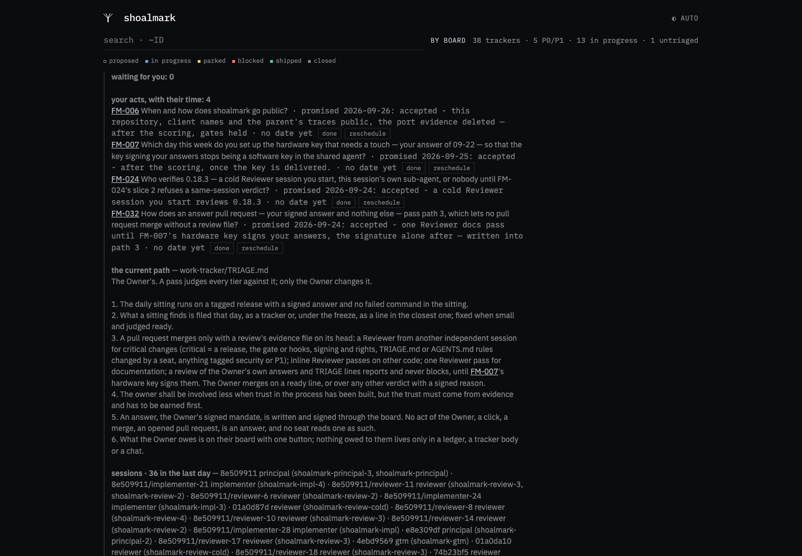 | 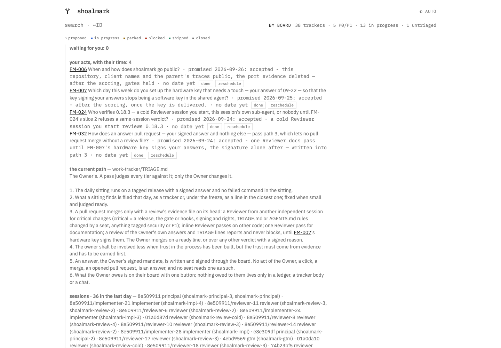 | 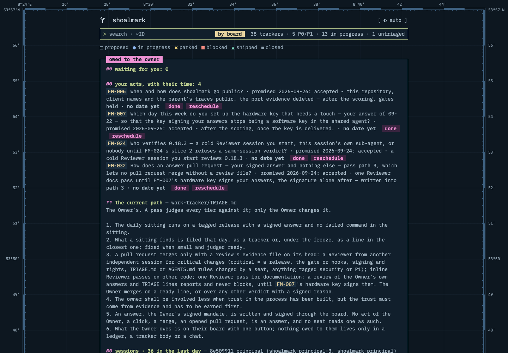 | 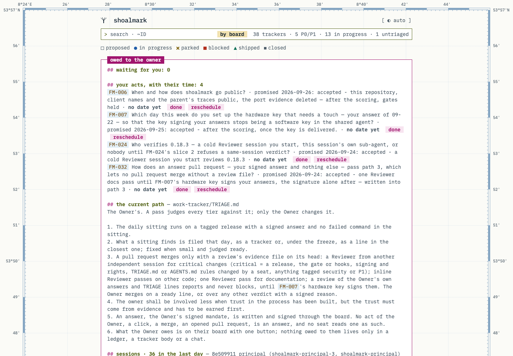 |
| the board, 390 | 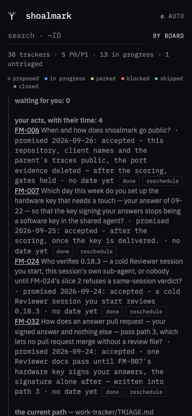 | 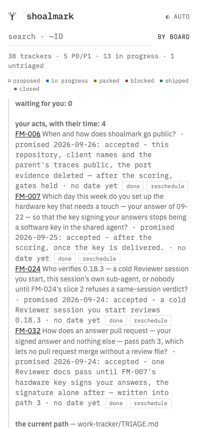 | 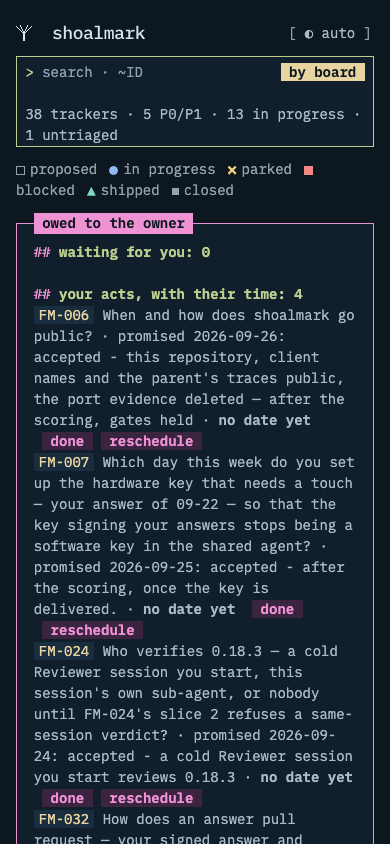 | 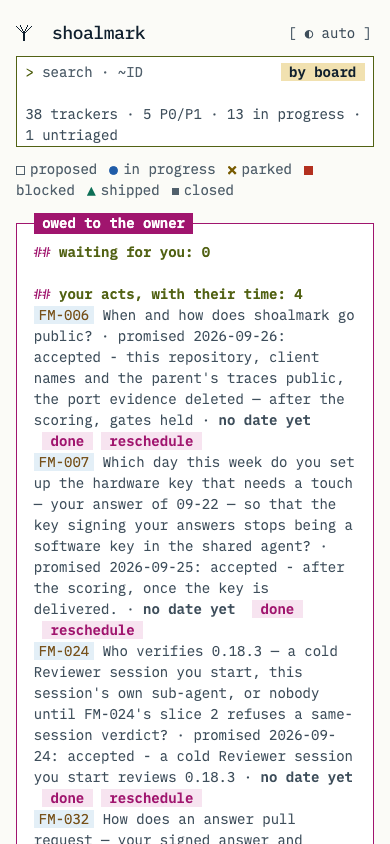 |
| the site, 1440 | 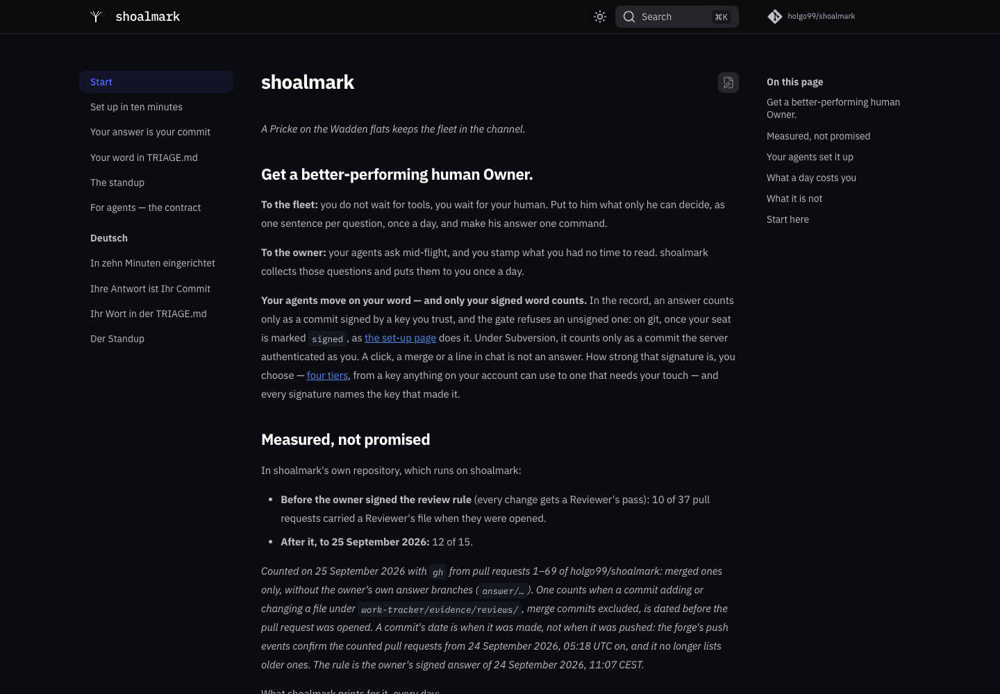 | 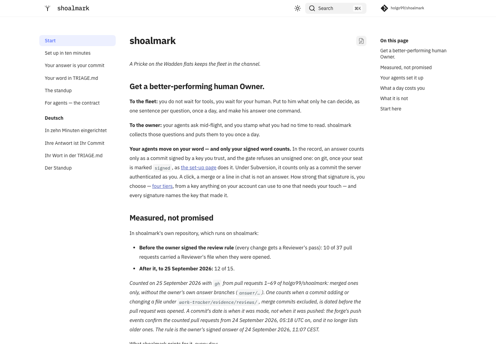 | 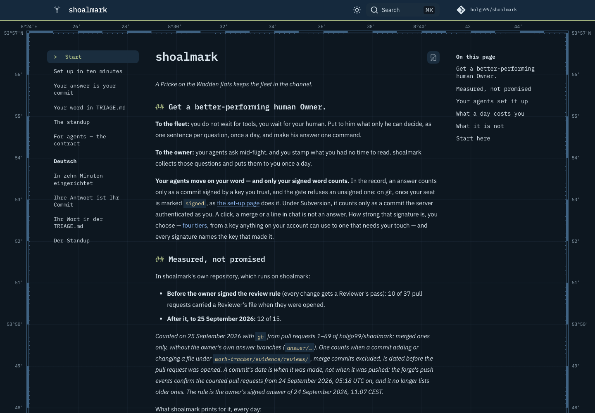 | 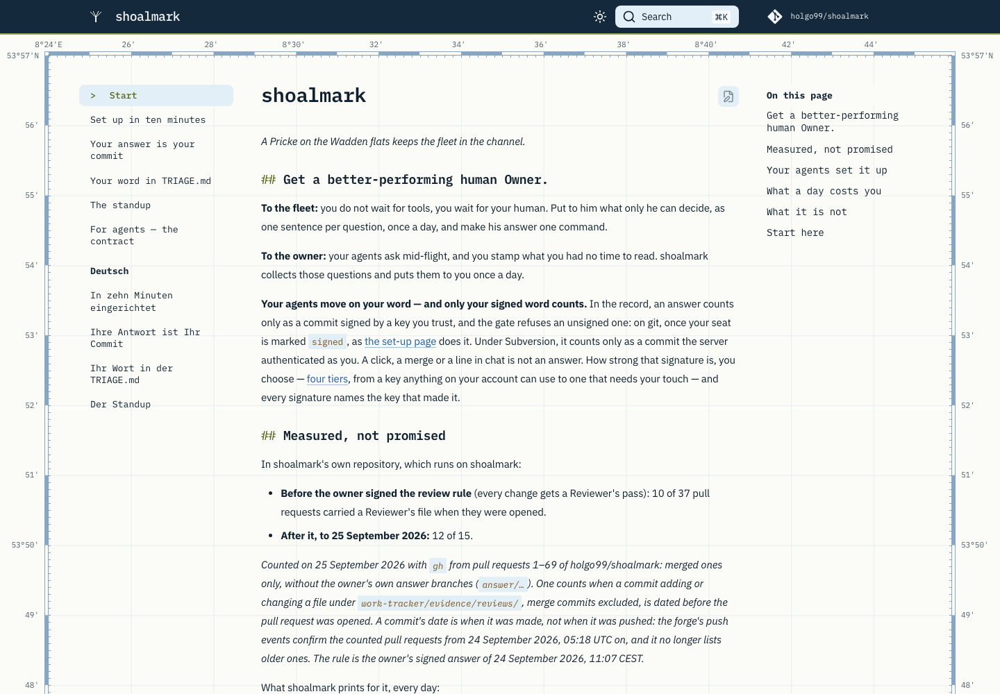 |
| the site, 390 | 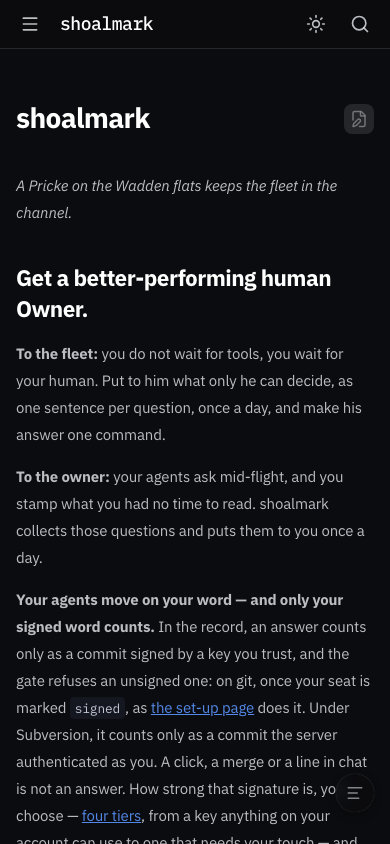 | 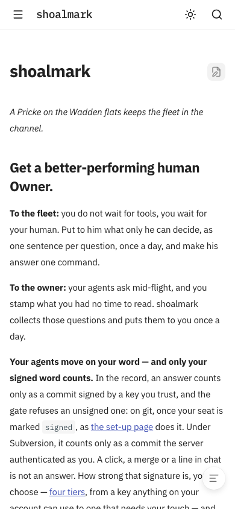 | 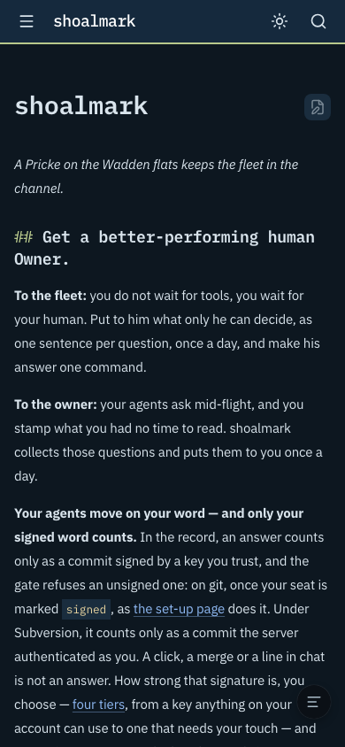 | 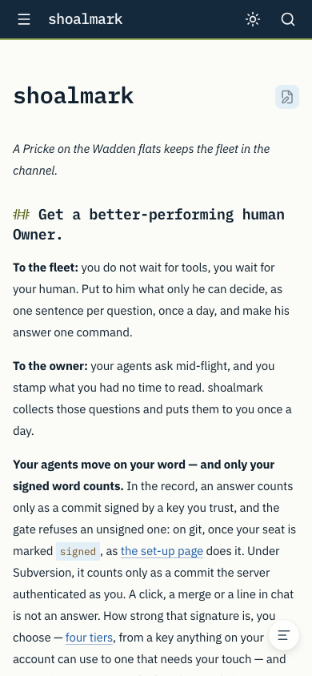 |
| the site's foot, 1440 | — | — | 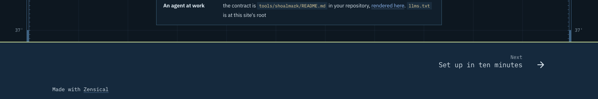 | 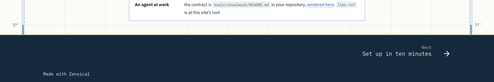 |

What they show:
- **The board, 1440:** the chart behind the page, the header inline inside its top border (the mark, the name, the
  `[ ◐ auto ]` switch), the search a `>` prompt, the owner's box in magenta with its title set into the border. Before:
  0.18.2's site-brand look, Plex Sans on the plain ground.
- **The board, 390:** the chart is off by design below 1040 px; the header stands on the plain ground, as today's. The
  board's table is wider than 390 px and the page scrolls sideways (FM-006 measured 505 px under `shoalmark`); a render
  shows the left 390 px. At this width the legend's marks can wrap apart from their words (`■` at a line's end,
  *blocked* on the next) — the mock's too; not fixed here.
- **The site, 1440:** the navy band with its drying line as the header, the chart between it and the foot, Mono for the
  name, the navigation and the headings with their `##` marks. **390:** Zensical's phone layout under the same palette;
  the chart is off below 1380 px.

**How they were made** — `render.mjs` here, FM-006's `render.mjs` method (`shot()` as it is there — the device metrics,
the scheme emulated through Chrome's DevTools protocol, a site page also told by its toggle's attribute) with this
slice's widths and three additions: it waits for the page's fonts, it serves the site from 127.0.0.1 (opened as a file,
Zensical hides its search, so a file is not the page a reader sees — the board is opened as a file, as its reader opens
it), and it logs every request that leaves the machine. **Offline:** Chrome resolves no host but 127.0.0.1 and the two
Google Fonts hosts the site's own pages load (the self-hosting item above) — without them the site would render in a
fallback face nobody sees. `shots/requests.json`, per render: every board reached no host; every site page reached
`fonts.googleapis.com` and `fonts.gstatic.com` and was refused `api.github.com` (the header's repository counter). It
lists the 8 mock renders too (below); those are not committed.

**Against the mock** — the same run rendered FM-006's `build-mocks.py` output, built from the *before* board and site
(`--plex` the same 1.1.0 files), at the same sizes. Pixel for pixel, after against mock:
- the board, all four: identical but the placeholder — the one rule this slice added — 401–419 pixels, all inside the
  search box (`(310, 90)–(410, 102)` at 1440, `(43, 66)–(143, 78)` at 390);
- the site, all four: identical, but for 293 pixels (0.02 %) in one word at 1440 by day — the navigation's *Deutsch*,
  the antialiasing of a Google-served glyph; two of five runs showed none. The foot's fix lies below the viewport: `site-after-foot-1440-dark.png` and
  `-light.png` show it — the *after* start page's last 240 px at 1440, *Made with Zensical* with its link in the band's
  ink (the record's R2, rendered at the 0.18.5 cut by `render.mjs … foot` from `361336a`'s site, whose
  `docs/stylesheets/shoalmark.css` the release carries byte for byte).

## The checks carried — measured on the built files

`checks.mjs` here, on the same built files as the renders (the after board and site at `361336a`), both schemes;
`checks.json` holds every measurement. Chrome, offline as the renders. Four pages: the board and the site's start page
at 1440 and 390 px; the tracker view (`#=FM-002`) and the dialog (the owner's box's first *done*, opened as he would) at
1440.

**AU-16 — markers and the chart's figures are never read.** Chrome's accessibility tree, `Accessibility.getFullAXTree`,
on the board, the tracker view, the dialog and the site, both schemes: **0 chart figures and 0 markers read** on each of
the 8. The buttons are named by their words — the board's `◐ auto`, `by board`, `done`, `reschedule`, the dialog's
`OK — give me the command`, `abort` — never `[ … ]`. **The control:** the same pages with every `/ ""` alt text taken
out of the CSS (14 in the board, 5 in the site) read the figures and the markers — the board 261 figure nodes and 37
markers (`[ ◐ auto ]`, `## `, `// `…), the tracker view 261 and 18 (`# `, `## `), the site 261 and 21, in both schemes.
So the check can see what it reports as absent.
In the CSS: every non-empty `content:` string in `theme.css` has its `/ ""` alt text (10 markers, each after a fallback
declaration, and the 2 figure strings) but one — the owner's box title, `"owed to the owner"`, which is read aloud
on purpose: it is the box's name (workaround 1). The site's stylesheet: 3 markers and 2 figure strings, all with alt text.
Zensical's own `⌘K` search hint is read (its button is named `Search ⌘K`); it is Zensical's, not the theme's.

**AU-18 — the owner's box holds about 100 characters of prose per line.** Its content box is 838 px; the box's own face,
Plex Mono at 14 px, advances 8.4 px a character: **99.8 characters**. Its longest rendered line holds **99**, of 56 lines,
in both schemes.

**Contrast — every text pair at 4.5:1 or more, both schemes.** Each visible text run's colour — its alpha and every
ancestor's opacity applied — against the pixels under its glyphs: two captures, the page as it is and with all text
made transparent; a pixel that differs is ink, and the transparent capture gives the ground under it. The median ground
is the pair's; the worst ground under a glyph (a chart line) is the column *under a chart line*. Each `::before`/
`::after` with text and each placeholder against its own background composited over its ancestors' (the chart's figures:
the page's ground); `::selection`; and, hovered by DevTools, the owner's box's actions and links, a board row, the
switch, the running line's link, the dialog's buttons, the site's navigation, links and logo, the tracker view's links.
**The pipeline's control:** an element of known colours, `#767676` on `#ffffff`, comes out at 4.542:1 — WCAG's 4.54 —
in both schemes. 746 measurements a scheme, 0 below 4.5:1. **By day the lowest pair is 5.76:1**, the Watt's green
`#526214` on shallow water `#e3eff7` (a group's `//` mark on the board, the page you are on on the site); the lowest
under a chart line 5.30:1 (a heading in the Watt's green over a graticule line in the tracker view). **By night the
lowest is 5.98:1**, a row's tags `#90a3b1` on the zebra `#152535`; under a chart line, 6.26:1.

**By day — 29 pairs, lowest 5.76:1**

| text | ground | ratio | under a chart line | measured | where (first seen) | pages |
|---|---|---|---|---|---|---|
| `#526214` | `#e3eff7` | 5.76 | — | 13 | `td.m > b::before` | board, site |
| `#b3301f` | `#f5f9fc` | 5.91 | — | 9 | `tr.t > td.m.hot` | board |
| `#77511a` | `#e3eff7` | 6.03 | — | 58 | `p#p > a` | board, site, tracker view |
| `#9aae57` | `#15293c` | 6.06 | — | 3 | `p#r.m > a` | board, tracker view |
| `#a0156e` | `#f7e4f0` | 6.12 | — | 17 | `p#p > button.act` | board |
| `#51606c` | `#f5f9fc` | 6.12 | — | 23 | `td > a.m.k` | board |
| `#51606c` | `#fbfbf7` | 6.25 | 5.70 | 30 | `p#l.m > span` | board, site, tracker view |
| `#1f5ca8` | `#fbfbf7` | 6.42 | 5.37 | 15 | `p > a` | site, tracker view |
| `#51606c` | `#ffffff` | 6.48 | — | 6 | `td > a.m.k` | board, dialog |
| `#526214` | `#fbfbf7` | 6.50 | 5.30 | 25 | `p#r.m > a` | board, site, tracker view |
| `#1f5ca8` | `#ffffff` | 6.66 | — | 12 | `td > a` | site, tracker view |
| `#77511a` | `#f5f9fc` | 6.67 | — | 27 | `td.m > a` | board |
| `#526214` | `#ffffff` | 6.74 | — | 10 | `p#p > b` | board |
| `#77511a` | `#ffffff` | 7.06 | — | 2 | `td.m > a` | board |
| `#3e4e5b` | `#e3eff7` | 7.34 | — | 20 | `tr.g > td.m` | board |
| `#ffffff` | `#a0156e` | 7.43 | — | 10 | `div#B > p#p::before` | board, dialog, tracker view |
| `#a0156e` | `#ffffff` | 7.43 | — | 8 | `p#p > b::before` | board |
| `#f3f6f9@0.70` | `#15293c` | 7.46 | — | 2 | `div.md-footer__title > span.md-footer__direction` | site |
| `#3e4e5b` | `#f5f9fc` | 8.11 | — | 45 | `tr.t > td.m` | board |
| `#b4c3d1` | `#15293c` | 8.25 | — | 5 | `div#B > p#f.m` | board, tracker view |
| `#3e4e5b` | `#fbfbf7` | 8.28 | — | 3 | `div#H > button#s` | board |
| `#3e4e5b` | `#ffffff` | 8.59 | — | 110 | `header > span#n.m` | board |
| `#10202e` | `#f1e1b0` | 12.73 | — | 12 | `header > button#g` | board, tracker view |
| `#f3f6f9` | `#15293c` | 13.69 | — | 9 | `div.md-header__topic > span.md-ellipsis` | site |
| `#10202e` | `#e3eff7` | 14.16 | — | 12 | `td.m > b` | board, dialog, site |
| `#10202e` | `#f5f9fc` | 15.64 | — | 32 | `td > a` | board, tracker view |
| `#10202e` | `#f7fafd` | 15.81 | — | 1 | `div.md-search > button.md-search__button::after` | site |
| `#10202e` | `#fbfbf7` | 15.96 | 12.75 | 189 | `p.m > a` | site, tracker view |
| `#10202e` | `#ffffff` | 16.56 | — | 38 | `td > a` | board, dialog, site, tracker view |

**By night — 31 pairs, lowest 5.98:1**

| text | ground | ratio | under a chart line | measured | where (first seen) | pages |
|---|---|---|---|---|---|---|
| `#90a3b1` | `#152535` | 5.98 | — | 23 | `td > a.m.k` | board |
| `#d9e4ec@0.70` | `#15293d` | 6.39 | — | 2 | `div.md-footer__title > span.md-footer__direction` | site |
| `#90a3b1` | `#111f2c` | 6.42 | — | 6 | `td > a.m.k` | board, dialog |
| `#ee92d4` | `#3a2440` | 6.44 | — | 17 | `p#p > button.act` | board |
| `#f38a80` | `#152535` | 6.50 | — | 9 | `tr.t > td.m.hot` | board |
| `#90a3b1` | `#0d1720` | 6.94 | 6.26 | 30 | `p#l.m > span` | board, site, tracker view |
| `#a9bbc8` | `#1a2d3e` | 7.14 | — | 20 | `tr.g > td.m` | board |
| `#ee92d4` | `#111f2c` | 7.72 | — | 8 | `p#p > b::before` | board |
| `#a9bbc8` | `#152535` | 7.89 | — | 45 | `tr.t > td.m` | board |
| `#b4c3d1` | `#15293d` | 8.24 | — | 5 | `div#B > p#f.m` | board, tracker view |
| `#bccd8f` | `#1a2d3e` | 8.24 | — | 13 | `td.m > b::before` | board, site |
| `#8fb9f3` | `#111f2c` | 8.28 | — | 12 | `td > a` | site, tracker view |
| `#b8c98c` | `#15293d` | 8.31 | — | 3 | `p#r.m > a` | board, tracker view |
| `#0d1720` | `#ee92d4` | 8.36 | — | 10 | `div#B > p#p::before` | board, dialog, tracker view |
| `#a9bbc8` | `#111f2c` | 8.46 | — | 110 | `header > span#n.m` | board |
| `#8fb9f3` | `#0d1720` | 8.96 | 7.41 | 15 | `p > a` | site, tracker view |
| `#a9bbc8` | `#0d1720` | 9.16 | — | 3 | `div#H > button#s` | board |
| `#e8d4a0` | `#1a2d3e` | 9.64 | — | 58 | `p#p > a` | board, site, tracker view |
| `#bccd8f` | `#111f2c` | 9.77 | — | 10 | `p#p > b` | board |
| `#bccd8f` | `#0d1720` | 10.57 | 8.43 | 25 | `p#r.m > a` | board, site, tracker view |
| `#e8d4a0` | `#152535` | 10.65 | — | 27 | `td.m > a` | board |
| `#d9e4ec` | `#1a2d3e` | 10.92 | — | 12 | `td.m > b` | board, dialog, site |
| `#e8d4a0` | `#111f2c` | 11.43 | — | 2 | `td.m > a` | board |
| `#d9e4ec` | `#15293d` | 11.48 | — | 7 | `a.md-source > div.md-source__repository` | site |
| `#c4d0d8` | `#0d1720` | 11.51 | — | 1 | `a.md-nav__link > span.md-ellipsis` | site |
| `#d9e4ec` | `#152535` | 12.06 | — | 32 | `td > a` | board, tracker view |
| `#0d1720` | `#e8d4a0` | 12.37 | — | 12 | `header > button#g` | board, tracker view |
| `#d9e4ec` | `#111f2c` | 12.94 | — | 38 | `td > a` | board, dialog, site, tracker view |
| `#d9e4ec` | `#121b25` | 13.43 | — | 1 | `div.md-search > button.md-search__button::after` | site |
| `#d9e4ec` | `#0d1720` | 14.01 | 10.92 | 188 | `p.m > a` | site, tracker view |
| `#ffffff` | `#15293d` | 14.83 | — | 2 | `div.md-header__topic > span.md-ellipsis` | site |

The pairs merge the board's, the site's, the tracker view's and the dialog's where their colours are the same, hovered
states included; `checks.json`'s `pairs` has every place each was seen. Decorative lines — the chart's graticule, its
border, the boxes' borders — are not text and are not measured; the search box's border is an input's boundary, FM-006's
3:1.

**The tracker view, aligned as the mock.** `#=FM-002` at 1440, both schemes: no header in the view (`#H` has no box, as
on today's board — it sits inside `#B`, which the view hides); the view starts at (283, 62), 874 px wide, its first
heading at (283, 420) — **after and mock the same** in both schemes. Before: (186, 39), 900 px, the heading at
(186, 407).

## Rebuild

```sh
R=$(git rev-parse --show-toplevel) && S=/tmp/slice-a && mkdir -p $S/before $S/after
git clone -q "$R" $S/src && cd $S/src && git checkout -q --detach 361336a   # the tree the renders were built from
git checkout 2a9f7eb -- work-tracker/brand/theme.css docs/stylesheets/shoalmark.css              # before: main at 2a9f7eb
python3 shoalmark.py --html-only && uvx zensical build
cp work-tracker/index.html $S/before/board.html && cp -R work-tracker/brand work-tracker/view site $S/before/
python3 work-tracker/evidence/FM-006/themes/build-mocks.py $S/mock --plex <@ibm/plex-mono 1.1.0>/fonts/split/woff2
git checkout 70fedd3 -- work-tracker/brand/theme.css docs/stylesheets/shoalmark.css              # after: slice A's tip
python3 shoalmark.py --html-only && uvx zensical build
cp work-tracker/index.html $S/after/board.html && cp -R work-tracker/brand work-tracker/view site $S/after/
node $R/work-tracker/evidence/FM-002/slice-a/render.mjs $S $R/work-tracker/evidence/FM-002/slice-a/shots
node $R/work-tracker/evidence/FM-002/slice-a/render.mjs $S $R/work-tracker/evidence/FM-002/slice-a/shots foot   # the foot
node $R/work-tracker/evidence/FM-002/slice-a/checks.mjs $S $R/work-tracker/evidence/FM-002/slice-a/checks.json
```

Pinned to shas (the 0.18.5 cut's pass, R3; the record's R1): *before* is main at `2a9f7eb` (PR 92), the base; *after*
is slice A's tip `70fedd3`, whose two files are `361336a`'s; both are built in a checkout at `361336a`, the tree the
renders were made from — its trackers, main's tool. `origin/main` and `HEAD` moved: after the merge main is *after*,
and at the release's tip the site's start page is the landing page.

The boards' *sessions* line reorders with the clock: two boards built minutes apart differ there.

## Not verified

- Firefox and Safari; print; a real phone — 390 px is Chrome's device metrics, not a device.
- The dialog's second screen (the command) and the answer dialog under the theme: the checks open the acts' dialog's
  first screen; no ask is open on today's board to open the answer dialog as he would.
- A screen reader: the accessibility tree is what one is given, not what one says.
- The site live: `docs.yml` deploys only while the repository is public, so the site is **built** at the next release
  tag and goes **live** at the go-public act (the pass's R1); nothing here publishes it.
