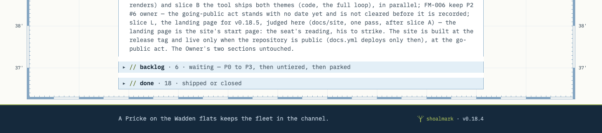
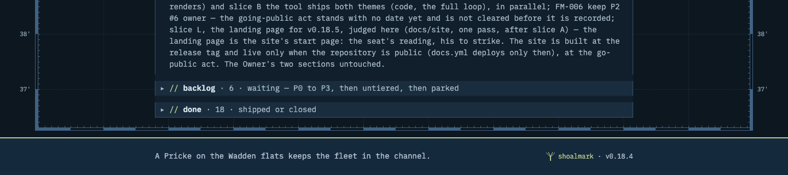
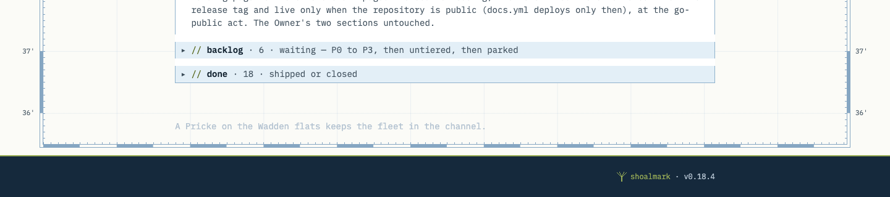

# FM-002 slice B — the tool ships `monochrome` and `shoalmark`: the renders behind pass 1's R1 and R2

The Implementer seat, session `8e509911/implementer-37`, worktree `shoalmark-impl`, branch
`fm/002-slice-b-the-tool-ships-themes`, 2026-09-26. The Reviewer's pass 1 on `9f2f525`
(`evidence/reviews/review-fm-002-slice-b-f11bc04.md`, NOT READY) named two P2s that only renders can close: R1, slice A
and slice B together broke this repository's foot, and R2, the Owner's box lost its title off the board view.
This folder holds the renders and the measures for both. Every render was made by Chrome headless through its DevTools
protocol: full pages, the colour scheme emulated, fonts loaded first, pixels compared exactly (0 of 0 tolerance).

## R1 — this repository's board: slice A's approved look, on slice B's hooks

**Before** is what the Owner approved at 16:06: slice A's `work-tracker/brand/theme.css` at `b9644b7e` on main's tool
(`bef2a1e`, the same `shoalmark.py` as slice A's). **After** is the re-cut theme on this branch's tool. It is slice A's
theme with hooks 1 and 2 in place of its workarounds 1 and 2, and workaround 3, the mock's `nth-child` stripes, kept.
Both were built from one snapshot of this branch's `work-tracker/` and rendered in place, so the font URLs resolve as
they do on the board.

| View | Widths | Schemes | Pairs | Result |
|---|---|---|---|---|
| the board | 1440, 1000, 390 | light, dark | 6 | identical |
| a search (`#FM-00`) | 1440, 1000, 390 | light, dark | 6 | identical |
| the story view (the grouping button once) | 1440, 1000, 390 | light, dark | 6 | identical |
| a tracker (`#=FM-002`) | 1440, 1000, 390 | light, dark | 6 | identical |

**24 of 24 identical.**

**The foot, measured.** Taken on the board at 1440 px, in both schemes:
- **Without the re-cut**, slice A's theme on this branch's tool (the defect R1 found): the claim stands at y 2156–2177
  on the chart's ground, above the band, which starts at 2213. Its ink, `#b4c3d1`, reads **1.74:1** on `#fbfbf7` by day
  and 10.05:1 on `#0d1720` by night. The running line is alone on the band.
- **After**: the claim and the running line share one line (y 2156–2177), and the band starts 24 px above it (2132).
  The claim reads **8.25:1** on the band `#15293c` by day and **8.24:1** on `#15293d` by night.

`shots/` holds the foot, the page's last 320 px at 1440:

| | light | dark |
|---|---|---|
| before — slice A as approved |  |  |
| after — re-cut on the hooks |  |  |
| without the re-cut (the defect) |  | |

## R2 — the Owner's box keeps its title in every view

`draw()` now writes the title, `` with the label `owner.title`, wherever it draws `#p`, not only on
the board view. Each starter was worn from the person's place and built by this branch's tool, then compared with FM-006's
`build-mocks.py` output built by main's tool, on one snapshot of `origin/main`'s trackers at 1300, 1000 and 390 px, in
both schemes:
- **a search:** 12 of 12 identical;
- **the story view:** 12 of 12 identical but the search box — its empty input shows the placeholder, the one rule the
  starters add (313–419 px, x 240–339, y 90–101 at 1300).

The box keeps its title in all 24. The suite now checks that the board, a search and the story view each carry the
title.

## The rest of the slice, for the record (the commit bodies hold the detail)

- **The default look:** `origin/main`'s tool against this branch's tool on one scratch board — a queue, an ask, five rows
  in a group, a claim — at light and dark, 1300 and 390 px, the board, a tracker's view and the answer dialog: 12 of 12
  PNGs byte-identical (`919eb86`).
- **The starters against the mocks:** the board, a board with no claim, the dialog page and a tracker's view, 1300,
  1000 and 390 px, both schemes. The tracker views are identical. The boards differ only in the search box, the
  placeholder, and with that rule taken out, 48 of 48 are identical (`9f2f525`). Worn through `--brand … --from` and
  rendered by FM-006's own `render.mjs`, 4 of 14 are identical and 10 differ only in the search box.
