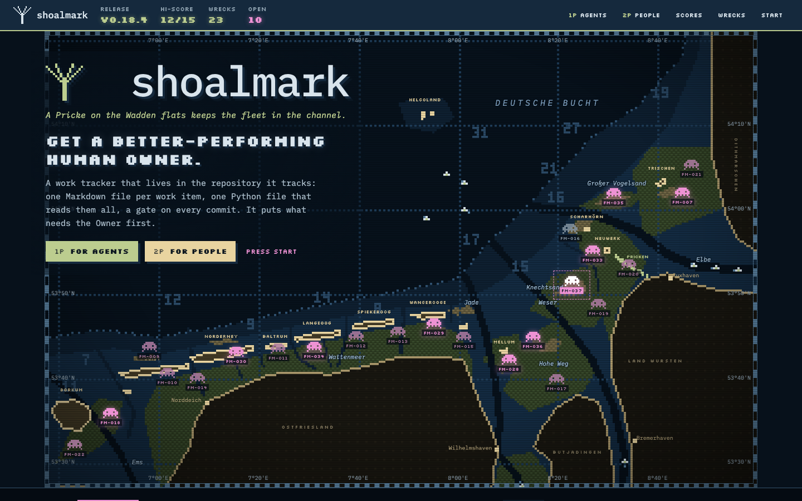
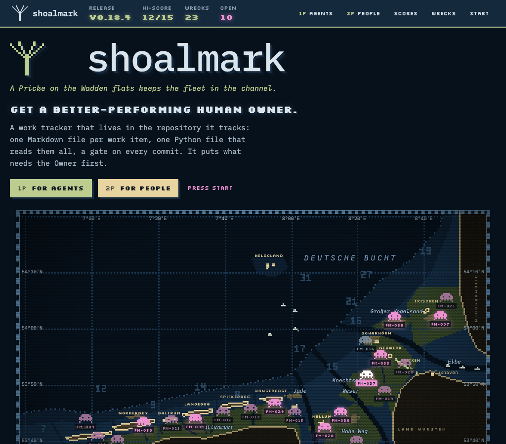
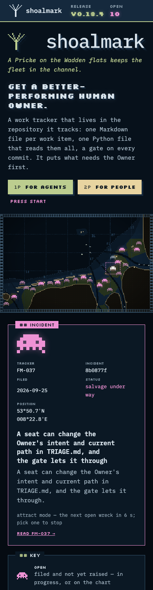
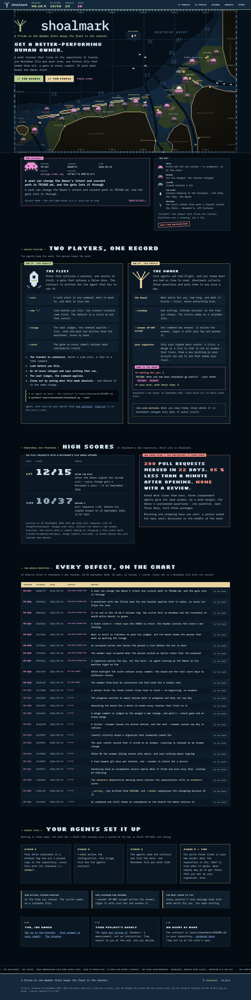

# The landing page — the GtM/Design seat, 2026-09-26

**A mockup in the `shoalmark` theme. Nothing adopted, nothing built.** `index.html` is the page: one file, open it in a
browser. It loads IBM Plex Mono and Silkscreen from Google Fonts, as the site loads its fonts; everything else is in
the file.

## What the Owner asked — in chat, 2026-09-26, spelling normalised

His words, not a signed answer.

> A landing page for `shoalmark` showing the current release version, its features and claims: For Agents, For
> People. Nautical chart inspired with the graticules, a charting in the background with the German Wadden flats,
> sandbanks and channels. The chart renders ship wrecks, each with a tracker number, incident ID and a short incident
> report. This is the landing page a person sees first and an agent might be guided to by their Owner — make it count!
> Hold the `shoalmark` identity and show the selling points. Design direction: retro console/terminal typographic,
> arcade, Space Invaders inspired nautical theme.

On the result: *"you nailed it — file, commit and push"*.

## The page

**Attract mode:** an arcade cabinet's attract screen whose playfield is a night chart of the German Bight's Wadden coast.

- **The playfield.** Borkum to Dithmarschen, Helgoland offshore, drawn pixel by pixel on a 320 × 205 canvas and scaled
  by a whole number where the window allows. The islands, the tidal flats and sandbanks, the Ems, Jade, Weser and Elbe
  and the inlets between the islands, soundings in a 3 × 5 pixel figure, a dotted ten-metre line, the Pricken of
  Neuwerk's Wattweg, four ports. The graticule every ten minutes of latitude and twenty of longitude; the chart's
  graduated border with its figures, as the themes draw it. Convoys keep to the fairways, a pixel a step.
  **Not for navigation:** the geography is a drawing from approximate coordinates, and the key says so.
- **The wrecks.** The 23 trackers tagged `bug` or `security` in this repository, in chart magenta — the colour of what
  must be heeded — drawn as a capsized hull with its ribs up: an invader. Open ones (10: In Progress or Proposed)
  shuffle in two frames; raised ones (12: Shipped) lie dim; the closed one (FM-016) is grey. Each is a button; the
  incident console shows its tracker number, its incident ID, the day it was filed, its status, its position and its
  report, and cycles through the open wrecks until someone picks one. The register below lists all 23 with a link to
  each tracker file. Positions are a drawing, not a fix.
- **The rest.** The HUD: the release, the hi-score, the wrecks, the open ones. *Select player*: 1P for agents — the
  commands, the five rules, the `--next` handshake, the contract and `llms.txt`; 2P for people — the board, the
  standup, one command per answer, the signed word, an excerpt of shoalmark's own board. *High scores*: 12/15 after the
  review rule, 10/37 before; *game over*: the repository it came from. *Insert coin*: the four stages, what a day costs,
  the three ways in. A ticker of what it is not. The foot: the claim, the mark, the version.
- **The identity.** The ruled wordmark, IBM Plex Mono, the navy band ending at the drying line, the theme's night
  palette and the chart's border. Silkscreen, a pixel face, sets only the arcade's words: the HUD, the headings, the
  buttons. The page is dark by choice: it is a screen.

## Where every fact comes from

Read on 2026-09-26, 10:15 CEST, from `origin/main` and this branch.

| On the page | From |
|---|---|
| release v0.18.4, 26 September 2026, its summary | the tag `v0.18.4` (09:58:57) and `CHANGELOG.md` on `main` |
| each wreck's tracker number, title and status | the tracker's front matter and `# ` line on `main` |
| each wreck's incident ID and filing day | `git log --diff-filter=A` on the tracker file: the commit that filed it |
| each wreck's report | the tracker's `hook:`, cut to its first sentence or two, code spans kept |
| *Get a better-performing human Owner*, the fleet and the owner, the four stages, what a day costs, what it is not, start here, 12/15 and 10/37 and how they were counted | `docs/index.md` |
| the state that outlives a session, the five rules, the cold start in one command, 200 pull requests in 22 days | `README.md` |
| the board's excerpt: *waiting for you: 1*, FM-006's ask, *your acts, with their time: 3* | shoalmark's own board, 26 September 2026 |
| the claim | `work-tracker/brand/labels.yaml` |

The statuses are a snapshot: 0.18.4 shipped fixes under FM-029, FM-030, FM-035, FM-036 and FM-037, whose trackers
are still In Progress on `main`, so they are still drawn as salvage under way.

## Checked

- **No script error** in Chrome at 1440, 1024 and 390 px wide. From 1280 px the title stands on the open sea; below
  it, above the chart; on a phone the chart fills the width and the names give way to the wrecks.
- **Contrast.** Every text pair measures 4.5:1 or more on the ground it sits on — 32 pairs, the HUD, the chart's
  names and figures, the wrecks' labels, the register. Four fell short on the way and were lifted: the raised and
  closed wrecks' labels (3.99–4.39 → 5.14 at least), and the water names over the flats (3.64 → 5.3, with a halo).
  The chart's pixels and lines are a picture and are not text.
- **Keyboard and reading.** Every wreck is a focusable button named with its number, its status and its title; the
  canvas carries a description; the register is the chart as a table.
- **Motion.** The chart draws in, the open wrecks shuffle, the convoys sail, the console cycles, the ticker runs — and
  with reduced motion none of it moves.
- **Not verified:** Firefox and Safari, a screen reader, print.

## Renders

`shots/`: the first screen at 1440 px, the whole page at 1440 px, the first screen at 1024 px and on a phone.

| | |
|---|---|
| 1440 px |  |
| 1024 px |  |
| 390 px |  |
| the whole page |  |
