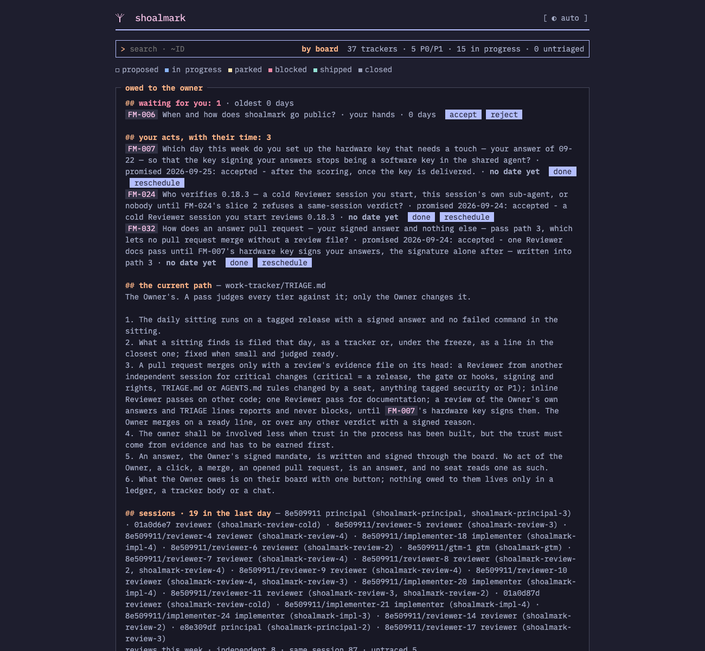
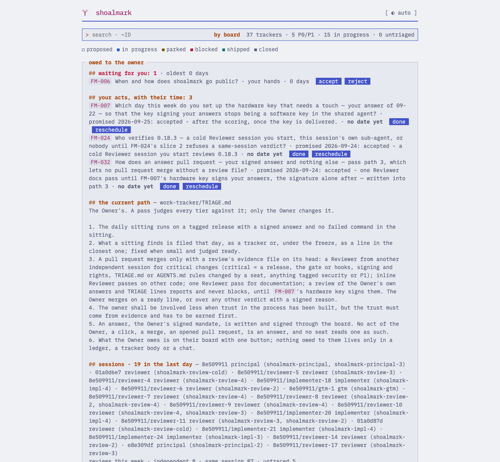
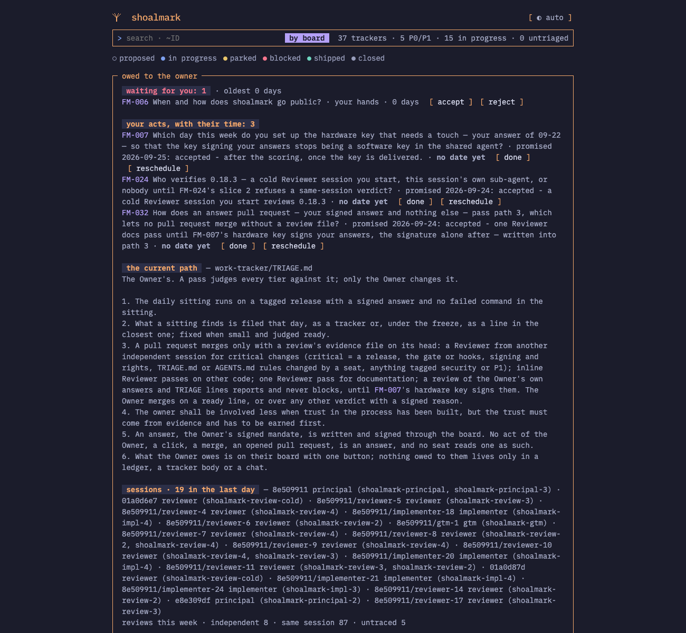
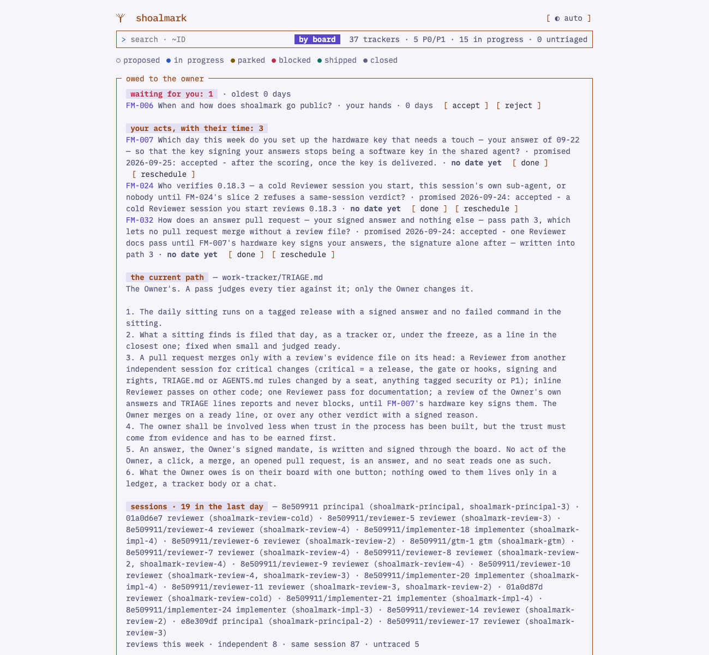
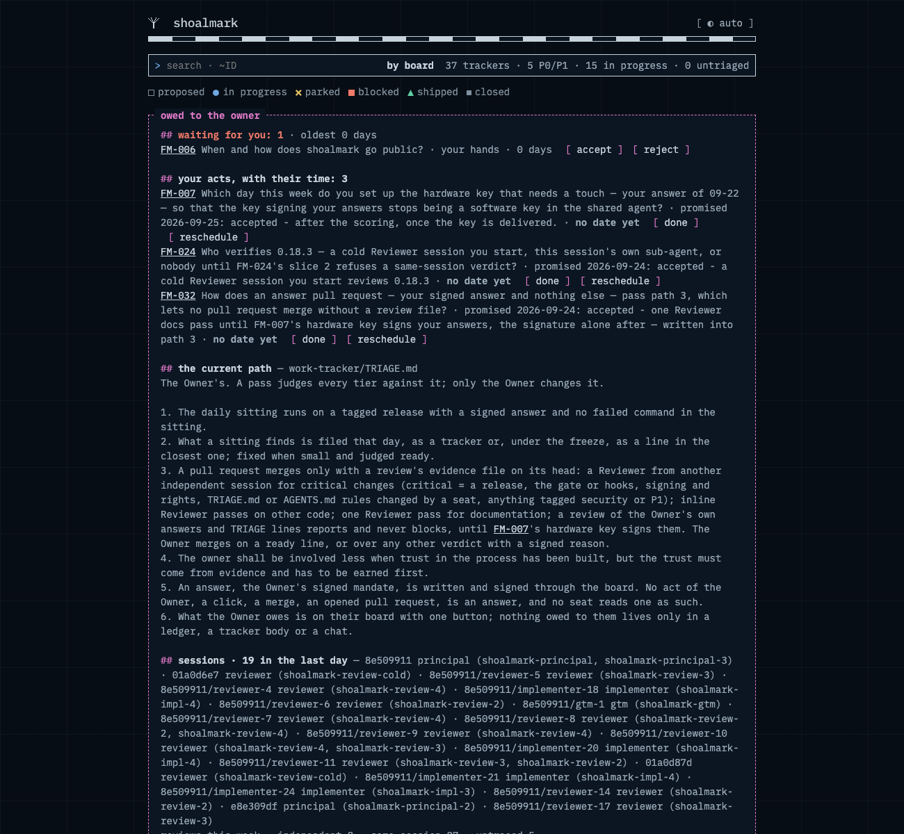
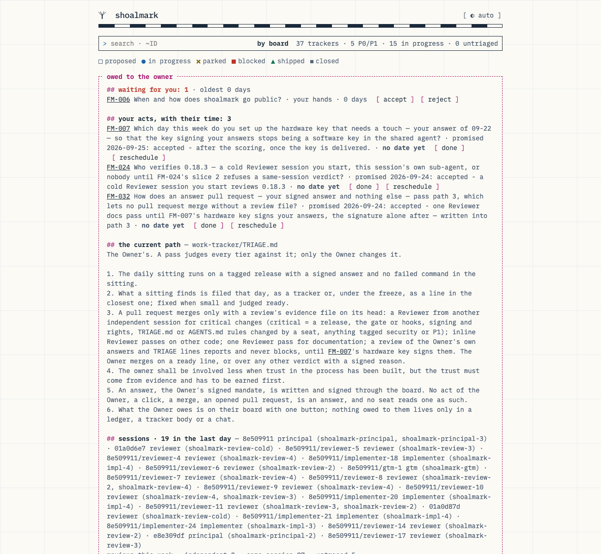

# The board's themes — the GtM/Design seat, 2026-09-25

**Candidates on the real board, CSS only. Nothing adopted, nothing built.** Five stylesheets over the page the tool
writes today, each a `theme.css` layer under FM-002's one rule. Two would ship as themes: `monochrome` and
`shoalmark`. Three are kept as additional mockups: `catkin`, `bagels` and `seekarte`.

## What the Owner said — in chat, 2026-09-25, spelling normalised

His words, not a signed answer. The ask drafted at the end is how they become one.

- The start, on WebTUI (webtui.ironclad.sh): *"to give it that terminal feel and be the perfect companion to the
  codex/claude terminal sessions"*. The seat's answer: WebTUI's idiom, not the library. The library styles its own
  attributes, so it would mean rewriting the tool's markup and shipping someone else's CSS into every consumer's board.
- On the last line: *"move icon + shoalmark + version to the right; move the claim where it was before, left aligned;
  remove the top separator"*.
- *"Yes, keep the current variant. These explorations shall land as additional mockups."*
- *"All are keepers. My guess is that users might want a setting for a theme, a theme library and a way to make their
  own — that is what we tried with the branding anyway."*
- On the seat's cheapest step: *"I agree to this direction"*. The step was to ship the themes as files in the tool's
  `brand/themes/`, have `--brand DIR --from <theme>` write a starter from one, choose a theme by putting a file in a
  place, and keep the four-place rule with no setting.
- *"We need a `shoalmark` theme besides the `monochrome` theme. Seekarte is a nice start but too playful. We need a
  strong starter."* Then: *"Catkin, Bagels, Catppuccin's palette inspired, but with an unmistakable shoalmark
  personality … explore the sea-chart direction; there are famous colour schemes and symbols in charting."*

**The Auditor seat's counsel, relayed by the Owner the same day.** Its three fixes are in every file here:
- a marker's alt text is `""`;
- the owner's box holds 100ch of prose;
- the site parity is a choice within the ruled IBM Plex family — no signed answer binds the board's face to the site's.

Its hold ("file after v0.18.4 is tagged") was lifted by the Owner's *"You file this"*. v0.18.4 is not tagged.

## The five

| File | Base | What it is |
|---|---|---|
| `monochrome.css` | — | **The terminal cut.** The site's palette. IBM Plex Mono for every word, on one grid. Boxes are titled in their top border; the search is a `>` prompt; an action is a `[ bracketed ]` word; a group is a `// comment`; a tracker's view prints its `#` marks. The frame is 104ch, so the owner's box holds 100ch of prose. The last line has the claim on the left and the mark with the version on the right, with no rule. |
| `shoalmark.css` | monochrome | **The brand's own, and the starter to make yours from.** A sea chart's colours as ECDIS draws them (IHO S-52): pastel by night, deepened to 4.5:1 by day. The name stands in a navy band, full width like the site's header, which ends at a drying line in the Watt's green. The Watt's green carries headings, the prompt and the running mark. Land buff carries the record's header row and the ids. Magenta carries what is owed to the Owner and nothing else: the box's line, its title as a label, tinted action chips, the dialog. Status marks take the buoyage's shapes: sphere, starboard cone, special mark's cross, port can. Every rule names only tokens, so a fork changes two blocks. |
| `catkin.css` | monochrome | Catppuccin's Mocha and Latte, after the Catkin Forge reference: peach markdown headings, pink id chips, lavender action chips. |
| `bagels.css` | monochrome | A Textual TUI's grammar, after Bagels: a lavender header bar, zebra rows, group bands, round dots, the owner's box as the focused panel in peach. |
| `seekarte.css` | monochrome | The first sea-chart study. The Owner found it too playful (a graticule, a scale bar, a dashed caution line); `shoalmark` is its strong form. |

`catkin` and `bagels` are working names. They name other projects and are renamed before either ships. Catppuccin's
palette is MIT, and is credited in `NOTICE` if a theme built on it ships.

## How it was made and checked

- **The page is the real board.** `build-mocks.py` injects the stylesheets into `work-tracker/index.html` as
  `python3 shoalmark.py --html-only` writes it; nothing else changes. `render.mjs` renders it in Chrome with the
  colour scheme emulated.
- **Fonts.** Plex Mono SemiBold and Italic come from `@ibm/plex-mono` 1.1.0's split Latin-1 cuts, the release whose
  Regular the repository already carries (sha256 `10d3c7fa…`, identical). Borders are CSS, and every drawn character
  is ASCII: the cuts are Latin-1, so box-drawing glyphs would fall back to another face.
- **Contrast, both schemes.** Every text pair a rule uses measures 4.5:1 or more, and every status mark 3:1 or more.
  Checked: `shoalmark` 29 text pairs and 8 mark pairs; `catkin` 28, `bagels` 31 and `seekarte` 30, text and marks
  together; `monochrome` the 7 pairs its rules add to the site's palette. In `shoalmark` the search box's line is an
  input's boundary and holds 3:1 or more. The boxes' borders and the drying line are decorative and sit below 3:1.
  Four text pairs fell short on the way and were fixed: one each in `catkin` and `monochrome`, two in `bagels`, all
  text on a raised surface at 4.27–4.45.
- **Markers are drawn, never read.** In Chrome's accessibility tree the buttons are named `accept`, `reject`, `done`,
  `reschedule`, `OK — give me the command` and `abort` in every theme. The control, without the alt text, read
  `[ accept ]` and exposed `## ` ×4, `// ` ×5 and `[ ` ×9 as text.
- **Defects found in the mock, and fixed there:**
  - At 104ch the group rows forced the table to 993px, past an 874px frame: `td.m` never wraps. They wrap now.
  - `shoalmark`'s band covered the tracker view's first line. The view now starts below the drying line.
- **Not verified:** a phone's width (headless Chrome will not go below about 500px), Firefox and Safari, and print.

## What the build is — not done

It is code, so a pass judges it first (FM-033) and the full review loop follows:
- `brand/themes/monochrome.css` and `shoalmark.css` in the tool, with the two fonts beside them.
- `--brand DIR --from <theme>`, writing the starter from a theme.
- In the markup:
  - the owner's box title as a label, because `labels.yaml` cannot reach CSS `content:`;
  - one footer element, because lifting the running line onto the claim's line is a CSS workaround;
  - a class on striped rows, because group rows break `nth-child`.

The one rule and "no setting" stay. The tool's default look stays for every consumer: a theme is a file someone puts
in a place.

## The ask, drafted

It is raised when FM-006's open ask (going public) is answered, because a tracker holds one ask.

> **ask:** Does shoalmark ship two themes — monochrome and shoalmark, as files in the tool's brand/themes/ that
> `--brand DIR --from <theme>` starts from — and which does its own board wear?
> **options:** both, this board wears shoalmark | both, this board wears monochrome | not yet — the board keeps today's
> look · **proposal:** both, this board wears shoalmark — the brand's own, and the starter the library is made from

## Renders

`shots/`: every theme's board, dark and light; the answer dialog for `monochrome` and `shoalmark`; `shoalmark`'s
tracker view.

| | dark | light |
|---|---|---|
| monochrome |  |  |
| shoalmark |  |  |
| shoalmark — the dialog |  |  |
| catkin |  |  |
| bagels |  |  |
| seekarte |  |  |

## Rebuild

```sh
python3 shoalmark.py --html-only
python3 work-tracker/evidence/FM-006/themes/build-mocks.py /tmp/themes --plex <@ibm/plex-mono 1.1.0>/fonts/split/woff2
node work-tracker/evidence/FM-006/themes/render.mjs /tmp/themes work-tracker/evidence/FM-006/themes/shots
```

To see a theme on your own board today, put its files in your own place, `~/.config/shoalmark/theme.css`: the base
first, then the theme. The fonts are not there, so the browser synthesises the bold and the italic.
